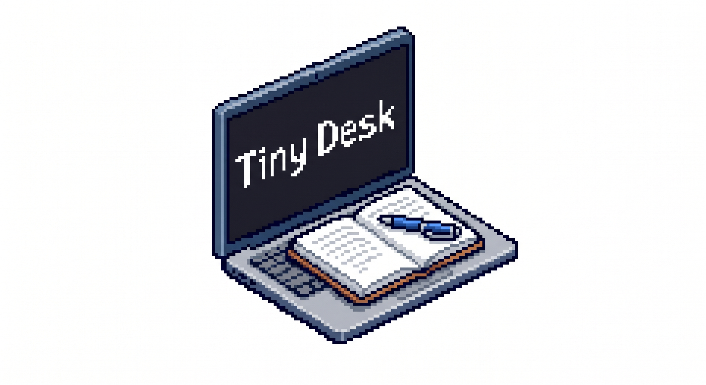

<div align="center">
  

  # 💻 TinyDesk - Input Controller
  **Smart Control Application for Keyboard & Touchpad with Global Hotkey Support!**
  
  []()
  []()
</div>

---

Hello! Welcome to **TinyDesk**. This application is specifically designed for those who need quick control to block Keyboard or Touchpad inputs effortlessly. Just use the hotkey combinations and you're all set!

## 📖 The Story Behind TinyDesk

I actually built this app out of a personal frustration! My study desk is very small and only has enough room for my laptop. Because of this, whenever I need to do my written homework, I have to place my notebooks directly *on top* of my laptop's keyboard. 

Unfortunately, doing so constantly triggers accidental keystrokes and touchpad clicks, messing up my screen and interrupting my focus. It was incredibly annoying! That's why I created **TinyDesk**—to quickly turn off the keyboard and touchpad so I can comfortably write my assignments right on top of my laptop without any accidental clicks. I hope this tool helps you too!

## 🚀 Key Features

✨ **Always On Top** — The app stays in the foreground for easy access.  
🎯 **Smart Position** — Automatically snaps to the **top right corner** of your screen without obstructing your main workflow.  
📥 **Taskbar Integration** — Now appears in the Taskbar so it's easy to find!  
📦 **Ultra Lightweight** — Runs smoothly in the background without draining your laptop's resources.  
🔒 **Highly Secure** — Utilizes low-level system hooks (WH_KEYBOARD_LL), making it impossible for other apps to bypass.  

---

## 🎮 Operating Modes

TinyDesk offers 3 main modes that you can select directly from the app:

| Mode | Description |
| :--- | :--- |
| **Disable Keyboard** | Completely blocks keyboard input, but the Touchpad remains active. |
| **Disable Touchpad** | Blocks touchpad input, leaving the Keyboard free to use. |
| **Disable Both** | Disables both! (Perfect for when you're cleaning your laptop 🧹) |

---

## ⌨️ Shortcut List (Global Hotkeys)

This application is incredibly powerful thanks to its global shortcuts. Remember these hotkeys:

- 🟢 **`Ctrl` + `T`** → Re-enables the Touchpad.
- 🔴 **`Ctrl` + `K`** → Resets and enables EVERYTHING (Keyboard & Touchpad are active).
- 👁️ **`Ctrl` + `Shift` + `M`** → Hides / Shows the application.
- ❌ **`Ctrl` + `Shift` + `C`** → Closes the application completely (Exit).

---

## ⚙️ Installation & Requirements

**System Requirements:**
- OS: Windows 7, 10, or 11
- .NET Framework 4.5+
- Must be run as **Administrator**

**How to Run:**
```bash
# Simply build via .NET
dotnet build -c Release

# Or just run the TinyDesk.exe file
```
Find the compiled `.exe` file in the `bin/Release/TinyDesk.exe` folder and double-click it (don't forget to Run as Administrator!).

---

## 📁 Important File Structure

```text
TinyDesk/
├── MainForm.cs              # Core logic & hotkeys
├── MainForm.Designer.cs     # UI Design & layout
├── Config.cs                # Easy customization settings!
├── assets/                  # Logos & images
└── README.md                # This file you are reading
```

---

## 📜 License & Attribution

**Author**: Muhammad Bintang Bagas Prasetya  
**Last Updated**: June 4, 2026  

This project is licensed under **Creative Commons Attribution-NonCommercial (CC BY-NC)** and **CC BY-SA 4.0**.

You are highly encouraged to:
- 📥 **Download** and use this application for daily purposes (for free!).
- 🛠️ **Modify** the source code for learning or personal use.

**Under the primary condition**:
- 🚫 **Non-Commercial** — It is strictly prohibited to resell this application or its source code in any form.

<div align="center">
  <br>
  
  <br>
  <i>Made with ❤️ by Muhammad Bintang Bagas Prasetya</i>
</div>